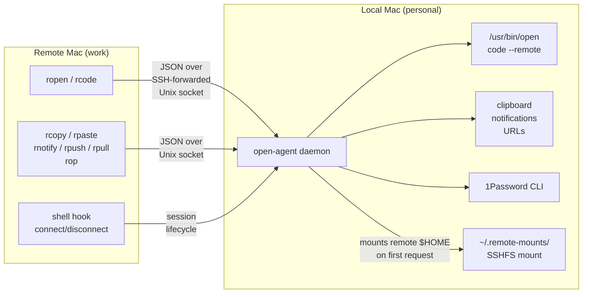

# open-agent

Bridge your local Mac's capabilities to remote SSH sessions.

A lightweight Deno daemon that runs on your personal Mac, receives requests from a remote machine via SSH-forwarded Unix socket. Opens files, transfers files, shares clipboard, sends notifications, opens URLs, and proxies 1Password CLI — all from the remote terminal.

## How it works



1. SSH session forwards a Unix socket from local to remote
2. Shell hook on remote registers session with the agent
3. Agent mounts remote `$HOME` via SSHFS on first session (or reuses existing mount)
4. `ropen README.md` sends a request over the socket
5. Agent translates the remote path to the SSHFS mount path, calls `open` locally
6. On last session disconnect (+ 30s grace period), the SSHFS mount is cleaned up

## Requirements

**Local (personal) machine:**

- macOS
- [Deno](https://deno.land/) runtime
- [macFUSE](https://osxfuse.github.io/) + sshfs (`brew install --cask macfuse && brew install gromgit/fuse/sshfs-mac`)
- [terminal-notifier](https://github.com/julienXX/terminal-notifier) for notifications (`brew install terminal-notifier`)
- [1Password CLI](https://developer.1password.com/docs/cli/) for `rop` proxy (optional, `brew install --cask 1password-cli`)
- socat recommended (`brew install socat`), falls back to netcat

**Remote (work) machine:**

- socat or netcat with Unix socket support

## Install

**Quick install (downloads latest release):**

```bash
curl -fsSL https://raw.githubusercontent.com/tlockney/open-agent/main/install.sh | bash
```

**From a local clone:**

```bash
git clone https://github.com/tlockney/open-agent.git
cd open-agent
./install.sh --local
```

The install script:

- Checks prerequisites (deno, sshfs, socat, terminal-notifier)
- Copies `open-agent-daemon.ts` to `~/.local/share/open-agent/`
- Copies all scripts to `~/.local/bin/`
- Installs and starts a launchd service
- Migrates config from legacy `~/.config/rproj/` if present
- Prints SSH config to add

After install, deploy scripts to remote hosts:

```bash
open-agent setup-remote all
```

## Repo layout

```
open-agent/
  bin/
    open-agent           CLI (setup-remote, update, status)
    ropen                Remote open wrapper
    rcode                VS Code remote-ssh wrapper
    rcopy                Copy stdin to local clipboard
    rpaste               Paste from local clipboard
    rnotify              Send local macOS notification
    rop                  1Password CLI proxy
    rpush                Push file to local machine
    rpull                Pull file from local machine
    rproj                Unified project management tool
    rtmux                tmux session wrapper
    lib/
      oa-remote.sh       Shared library for remote r* scripts
  open-agent-daemon.ts   Deno daemon
  com.open-agent.daemon.plist   launchd service template
  install.sh             Installer (curl|sh + --local mode)
  open-agent-hook.sh     Shell session hook (deployed to remotes)
  ssh_config.example     SSH config additions
```

## CLI

```bash
# Manage the toolkit
open-agent setup-remote workmbp   # Deploy scripts to a single remote
open-agent setup-remote all       # Deploy to all configured hosts
open-agent status                 # Check daemon status
open-agent update                 # Update to latest GitHub release
open-agent version                # Print version
```

## Usage

From an SSH session on the remote machine:

```bash
# Open a file with default app
ropen ~/docs/report.md

# Open with specific app
ropen -a "Marked 2" ~/docs/report.md

# Open a project in local VS Code (via remote-ssh)
ropen -v ~/projects/myapp

# Open a URL in the local browser
ropen https://example.com

# Works as 'open' alias (set up by the shell hook)
open ~/docs/report.md

# Clipboard bridge
echo "hello" | rcopy        # copy to local clipboard
rpaste                      # paste from local clipboard

# Local notifications
rnotify "Build complete"
rnotify -t "Deploy" -m "Deployed to staging" -s default

# File transfer
rpush build.tar.gz           # push file to local ~/Downloads
rpush -d ~/Desktop file.pdf  # push to specific local directory
rpull ~/Downloads/image.png  # pull file from local to remote cwd

# 1Password CLI proxy
rop read "op://vault/item/field"
rop run --env-file .env -- make deploy

# SSH-aware VS Code wrapper
rcode .                      # opens in local VS Code via remote-ssh
```

From the local machine via rproj:

```bash
# Open a project in Finder via SSHFS
rproj finder myproject
rproj f                    # interactive selection

# Check agent status
rproj status
rproj s
```

## Configuration

**Hosts file:** `~/.config/open-agent/remote-hosts`

Format (pipe-delimited, one entry per line):

```
host_alias|project_directory|label
```

Example:

```
workmbp|/Users/you/src/projects|Work Projects
workmbp|/Users/you/src/infra|Infrastructure
devbox|/home/you/code|Dev Box
```

Legacy config at `~/.config/rproj/hosts` is auto-detected with a warning.

**Environment variables (set on the remote machine):**

| Variable | Default | Description |
|----------|---------|-------------|
| `OPEN_AGENT_HOST` | `workmbp` | SSH config Host alias for the remote machine |
| `OPEN_AGENT_SOCK` | `/tmp/open-agent.sock` | Path to the forwarded socket |

**Agent constants (in `open-agent-daemon.ts`):**

| Constant | Default | Description |
|----------|---------|-------------|
| `UNMOUNT_GRACE_MS` | `30000` | Delay before unmounting after last session exits |
| SSHFS `cache_timeout` | `120` | Metadata cache in seconds (trade freshness for speed) |

## Limitations

- **Paths must be under remote `$HOME`.** The SSHFS mount covers the home directory only.
- **File-level latency.** SSHFS reads happen over SSH. Small files are fast; large binaries will be slow.
- **Stale mount recovery.** If the SSHFS mount hangs, the agent attempts remount on next request. The 3-second stat timeout prevents indefinite blocking, but a hung mount may need manual `umount -f`.
- **macOS only.** Both sides assume macOS (`open`, `diskutil`, launchd).

## Troubleshooting

**Socket not found on remote:** Verify SSH config has `RemoteForward` and `StreamLocalBindUnlink yes`. If using `ControlMaster`, kill the control socket (`ssh -O exit workmbp`) and reconnect.

**Mount failures:** Verify sshfs works manually: `sshfs workmbp:~ /tmp/test-mount`. Check that macFUSE kernel extension is loaded.

**Agent not running:** `launchctl list | grep open-agent`. Check logs: `cat ~/.local/share/open-agent/launchd-stderr.log`.

**sshfs not found by agent:** The launchd plist needs `/opt/homebrew/bin` in its PATH environment variable. Re-run `install.sh` or edit the plist manually.

**Stale SSHFS mount:** `umount -f ~/.remote-mounts/workmbp` or `diskutil unmount force ~/.remote-mounts/workmbp`.
