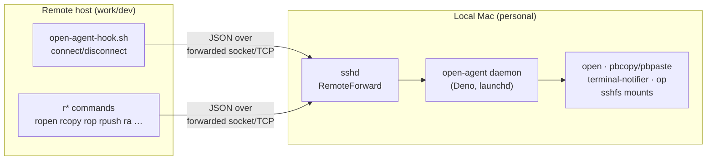
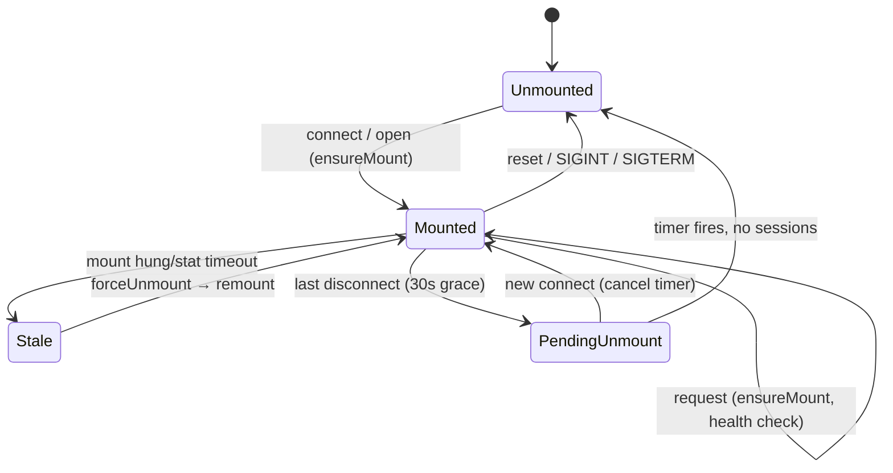
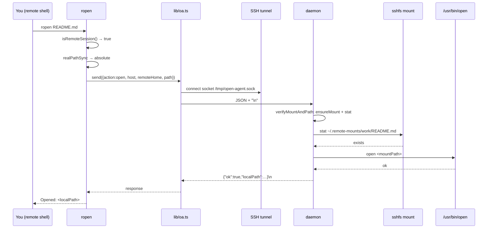

# Architecture

> **open-agent** bridges a local Mac's native capabilities to remote SSH
> sessions. A Deno daemon running on the personal Mac accepts JSON requests from
> remote machines (over an SSH-forwarded socket or TCP) and performs local
> actions: opening files, sharing the clipboard, transferring files, sending
> notifications, opening URLs, proxying 1Password, and managing SSHFS mounts.

This document describes the system as built. For day-to-day usage see
[`remote-workflow.md`](./remote-workflow.md); for transport evolution see
[`connectivity-plan.md`](./connectivity-plan.md).

---

## 1. High-level model

There are always **two sides**:

| Side | Runs | Role |
|------|------|------|
| **Local Mac** (personal) | `src/daemon/main.ts` (Deno, launchd) | Server: receives requests, executes local actions |
| **Remote host** (work Mac, dev box, etc.) | `r*` client commands + `open-agent-hook.sh` | Clients: send JSON requests over a forwarded transport |

The two sides are connected by SSH. SSH `RemoteForward` tunnels the daemon's
listener to a fixed path/port on the remote, so the remote commands can reach
the daemon as if it were local.

Every `r*` command is **dual-mode**: each one checks `isRemoteSession()` first
and runs the native local equivalent when it is *not* inside SSH. `rcopy` on the
local Mac pipes straight to `pbcopy`; `rop` execs the real `op`. Only inside an
SSH session does a command reach for the daemon. This is why the same binaries
can be installed everywhere.



---

## 2. Component map (repo layout)

```text
src/
├── daemon/                 # Local side, server
│   ├── main.ts             # Entry point: config, DI wiring, listeners, shutdown
│   ├── accept.ts           # Accept loop + per-connection error policy
│   ├── handlers.ts         # One handler per action, over injected deps
│   ├── mount_manager.ts    # SSHFS mount lifecycle (the stateful core)
│   └── logger.ts           # Append-to-file + stdout logging
├── lib/                    # Shared by both sides
│   ├── messages.ts         # Message union, Response/ErrorCode types, parseMessage
│   ├── framing.ts          # readMessage()/writeMessage() — newline framing
│   ├── oa.ts               # Client transport: send(), host identity, error render
│   ├── path_utils.ts       # translatePath() — remote path → mount path
│   └── rproj_utils.ts      # Pure helpers for rproj (parsing, fzf formatting)
└── cli/
    ├── args.ts             # Pure argument parsing + message building, all CLIs
    ├── ropen.ts            # Open files/URLs/VS Code
    ├── rcopy.ts rpaste.ts  # Clipboard
    ├── rpush.ts rpull.ts   # File transfer
    ├── rnotify.ts          # macOS notifications
    ├── rop.ts              # 1Password CLI proxy
    ├── ra.ts               # Admin/diagnostics: ping status mounts reset doctor
    ├── rcode.ts rtmux.ts   # Context-aware wrappers → ropen -v / rproj
    ├── rproj.ts            # Local project browser (fzf, multi-host, Alfred)
    └── open-agent.ts       # Local CLI: setup-remote, update, version

oa-wrapper.sh               # busybox-style dispatcher, installed under many names
open-agent-hook.sh          # Remote shell hook (sourced in .zshrc/.bashrc)
com.open-agent.daemon.plist # launchd service template (YOURUSER placeholders)
install.sh                  # Installer (curl|sh, --local, --no-daemon)
ssh_config.example          # SSH RemoteForward reference
deno.json                   # Tasks (test/check/lint/fmt), strict TS, lint rules

docs/
├── architecture.md         # This file
├── architecture.html       # Rendered twin of this file
├── remote-workflow.md      # User guide / setup
├── connectivity-plan.md    # Transport layer design (socket, TCP, Tailscale)
└── ipad-support-plan.md    # iPad client roadmap
```

Everything is **TypeScript run by Deno**, except the hook, the wrapper, and the
installer (`bash`). There is no build step and no bundler.

### 2.1 How the code is layered

The shape worth knowing is the split between **pure** and **effectful** modules,
because it is what makes the project testable without sockets or mounts:

- `src/lib/` and `src/cli/args.ts` are pure. Parsing, path translation, message
  construction, fzf formatting — no I/O, directly unit-testable.
- `src/daemon/mount_manager.ts` and `handlers.ts` are effectful but take their
  effects as injected interfaces (`MountDeps`, `HandlerDeps`). Tests supply fake
  `runCommand`/`stat`/`setTimeout` and drive real lifecycle logic.
- `src/daemon/main.ts` is the only module that constructs real `Deno.Command`,
  `Deno.stat`, and timers. It is the composition root and holds no logic.

`*_test.ts` files sit next to their subjects. `deno task test` runs them with
only `--allow-read --allow-env`, which is possible precisely because nothing
under test touches the network or spawns processes.

---

## 3. The daemon

### 3.1 Listeners (transport in)

`main()` opens **two** listeners:

1. **Unix socket** — `~/.local/share/open-agent/open-agent.sock` (primary)
2. **TCP** — `127.0.0.1:19876` (fallback for Tailscale SSH / iPad clients)

Both feed the same `acceptConnections()` → `handleConnection()` path. The TCP
listener exists because some SSH implementations (Tailscale SSH, iPad apps)
cannot forward Unix sockets — see `connectivity-plan.md`.

The TCP bind is **retried three times at 500 ms** and is allowed to fail: the
port may legitimately be held by an sshd `RemoteForward` when this machine is
*also* an open-agent remote. A failed TCP bind must not take down the Unix
listener, so it only logs and continues.

> The daemon does **not** authenticate connections. Binding is strictly
> localhost, which is safe only because traffic arrives inside an SSH tunnel.
> Exposing the TCP listener beyond loopback would require adding auth (not yet
> implemented). The daemon also does not currently inspect `conn.remoteAddr`
> beyond logging the transport, so it cannot yet distinguish loopback from
> non-loopback callers.

### 3.2 The accept loop (`accept.ts`)

Split out from `main.ts` so the retry policy is testable without binding real
sockets. Its one job is deciding which `accept()` failures are fatal:

- `BadResource` / `Interrupted` mean the listener was closed by `shutdown()` —
  a normal end to the loop.
- Anything else is treated as **per-connection noise**, not listener death.
  macOS returns `EINVAL` when a client closes between `connect()` and
  `accept()`, which every short-lived `r*` command does routinely. Treating that
  as fatal previously tore down the Unix listener on the first such connection.
- After `MAX_CONSECUTIVE_ACCEPT_ERRORS` (20) in a row, the listener is
  considered genuinely broken and the loop gives up.

If *both* loops return without a shutdown having been requested, the daemon is
running with no way to be reached. `main()` then exits **non-zero** on purpose:
the launchd job sets `KeepAlive/SuccessfulExit=false`, so a clean exit would be
read as "meant to stop" and the daemon would stay down until the next login.

### 3.3 Wire protocol: JSON-over-newline

A connection = **one request, one response**, both single-line JSON.

```text
client → {"action":"open","host":"work","remoteHome":"/home/me","path":"…"}\n
server → {"ok":true,"localPath":"/Users/me/.remote-mounts/work/…"}\n
```

Framing lives in `src/lib/framing.ts` and both sides use it, because neither
direction of a socket is message-oriented:

- **`readMessage()`** reads until the newline instead of taking a single fixed
  buffer. TCP has no message boundaries, so a payload can arrive split across
  several reads whatever its size. EOF also terminates a message, so a client
  that writes a payload and closes without a trailing newline is still
  understood.
- **`writeMessage()`** loops until every byte is out. `Deno.Conn.write`
  resolves with the number of bytes it actually accepted, which for a payload
  past the socket buffer is fewer than it was handed — a single un-looped
  write truncated large responses on the wire and left the peer waiting for a
  newline that never came.

One message is capped at `MAX_MESSAGE_BYTES` (8 MiB) so a peer cannot make the
daemon allocate without limit. The daemon refuses anything larger and closes;
`send()` checks the size up front so the client reports the limit rather than
a broken pipe.

`parseMessage()` (`src/lib/messages.ts`) validates the discriminated `Message`
union field-by-field and rejects anything malformed. The full action set:

| Action | Purpose | Local side-effect |
|--------|---------|-------------------|
| `connect` / `disconnect` | Session lifecycle → mount/unmount | registers session id; on last disconnect, schedules unmount |
| `open` | Open a file in default/specific app | `sshfs` mount → translate path → `open` |
| `open-vscode` | Open in VS Code remote-SSH | `code --remote ssh-remote+<host> <path>` (no mount) |
| `open-url` | Open http(s) URL in browser | `open <url>` |
| `copy` / `paste` | Clipboard | `pbcopy` / `pbpaste` |
| `notify` | macOS notification | `terminal-notifier` |
| `push` | Remote file → local | copy via SSHFS mount → `~/Downloads` (or `-d`) |
| `pull` | Local file → remote | copy via SSHFS mount to remote dest |
| `op-read` | Resolve one `op://` ref | `op read` (local 1Password CLI) |
| `op-resolve` | Resolve many `op://` refs in parallel | `op read` × N via `Promise.all` |
| `status` | Daemon introspection | returns version + per-host mount table |
| `ping` | Liveness probe | none — no mount checks, no subprocesses |
| `doctor` | Per-mount health probe | `stat` each mount with a timeout |
| `reset` | Tear down mount(s) and purge state | `umount` one host or all |

`ping` is deliberately inert so `ra ping` can distinguish "agent down" from
"agent up but slow on a real request". Secret-bearing actions (`op-read`,
`op-resolve`) never log the references or the resolved values.

### 3.4 Structured errors

Responses are **not** `{ok: false, error: "some string"}`. Failures carry a
typed object so clients can give accurate diagnostics and a recovery hint
instead of a blanket "agent unreachable":

```typescript
{ ok: false, error: { code: ErrorCode, message: string,
                      host?: string, recovery?: string } }
```

| `ErrorCode` | Meaning |
|-------------|---------|
| `transport_unreachable` | Could not reach the daemon at all (no socket, no TCP) |
| `daemon_unresponsive` | Connected, but no reply within the timeout |
| `mount_missing` | No mount entry for the requested host |
| `mount_stale` | Mount present in the table but unresponsive |
| `path_not_found` | Mount healthy, file genuinely missing on the remote |
| `auth_failed` | SSH/sshfs auth failed during (re)mount |
| `internal` | Unexpected daemon-side failure |

The distinction between `mount_stale` and `path_not_found` is the point of
`verifyMountAndPath()` in `handlers.ts`: when a `stat` of the target path fails,
it probes the **mount root** to disambiguate "your file isn't there" from "the
mount died under us". In the latter case it forces a remount and retries once
before giving up, and attaches `recovery: "ra reset <host>"` to the error.

`formatErrorMessage()` on the client tolerates the legacy plain-string shape, so
a new CLI talking to an older daemon still prints something sensible.

### 3.5 SSHFS mount management

The most intricate part of the daemon. One mount per remote host, at
`~/.remote-mounts/<host>`, mounted on demand and torn down when idle.



Key implementation details:

- **Per-host serialization (`mountLocks`)** — `ensureMount()` chains on a promise
  keyed by host so concurrent requests never spawn parallel `sshfs` processes.
  The chain uses `.catch()` shunts so one failed mount doesn't block later ones.
- **Health check** — `isMountResponsive()` first checks the `mount(8)` table,
  then runs `stat` with a 3 s `AbortSignal` timeout. A hung FUSE mount would
  otherwise block indefinitely.
- **Stale recovery** — if the mount exists but is unresponsive, `forceUnmount()`
  (plain `umount`, then macOS `diskutil unmount force`) and remount.
- **Session accounting** — `connect` adds a `sessionId` to a `Set`; `disconnect`
  removes it. When the set empties, `scheduleUnmount()` arms a 30 s timer
  (`UNMOUNT_GRACE_MS`); any new `connect` cancels it.
- **Path translation** — `translatePath()` `normalize()`s the remote path and
  requires it to be under the remote `$HOME`; it then rewrites it onto the mount
  point. Paths outside `$HOME` are rejected, because only `$HOME` is mounted.
- **Graceful shutdown** — `SIGINT`/`SIGTERM` close both listeners, remove the
  socket, and unmount every host before exiting.

`sshfs` is invoked with reconnect + keepalive options and metadata caching
(`cache=yes`, `cache_timeout=120`, `attr_timeout=120`) since slightly-stale
attributes are fine for opens.

The mount table lives **in memory only**. See §10 for what that costs across a
daemon restart.

### 3.6 Logging

`initLog()` opens `~/.local/share/open-agent/agent.log` for append; `log()`
writes a timestamped line to the file and an untimestamped one to stdout, which
launchd captures to `launchd-stdout.log` / `launchd-stderr.log` in the same
directory.

---

## 4. The remote side

### 4.1 The command wrapper (`oa-wrapper.sh`)

Remote commands are not separate scripts. A single POSIX `sh` file is installed
under **many names** in `~/.local/bin/` (`ropen`, `rcopy`, `ra`, …) and
dispatches on `basename "$0"`:

```bash
exec deno run --allow-read --allow-write --allow-run --allow-env --allow-net \
  "$OA_DIR/src/cli/$CMD.ts" "$@"
```

The `--allow-net` grant is deliberately unscoped: Deno ≥ 2.9 requires a net
grant for Unix socket connects, but the scoped `unix:<path>` syntax is a parse
error on older Deno, and remotes run mixed versions. (The daemon's own plist
*does* use the scoped form, since that machine's Deno version is known.)

### 4.2 Transport library (`src/lib/oa.ts`)

Shared by every `r*` client. Central pieces:

- **Session detection (`isRemoteSession`)** — true when `SSH_CONNECTION`,
  `SSH_TTY`, or `SSH_CLIENT` is set. Every client branches on this first.
- **Identity resolution (`resolveHost`)** — how the remote names itself to the
  daemon, used as the mount key: `OPEN_AGENT_HOST`, else
  `~/.config/open-agent/identity`, else the `UNRESOLVED_HOST` sentinel. Blank
  and whitespace-only values count as absent. There is deliberately **no
  `hostname -s` fallback**: the value must match an SSH `Host` alias on the
  local Mac, since the daemon feeds it straight to `sshfs`, and a remote's own
  hostname usually is not that alias — guessing mounts the wrong host instead
  of failing. `requireHost()` turns the sentinel into an actionable error, and
  `open-agent-hook.sh` resolves identity identically and declines to register a
  session when it comes back unresolved.
- **Socket path (`defaultSockPath`)** — differs by side. On a remote the daemon
  is reachable only through the tunnel, which binds `/tmp/open-agent.sock`.
  Locally the daemon binds its own socket under `~/.local/share` and never
  listens on `/tmp`, so a `/tmp` socket on the local Mac is at best a leftover
  from an inbound forward.
- **`send(message, timeoutSec)`** — try the Unix socket (2 s connect timeout),
  then fall back to TCP. Each transport's failure is reported separately;
  collapsing them into one generic message used to hide real causes (a dead
  daemon, a missing Deno permission) behind a guess about the tunnel.

**The TCP fallback is not unconditional.** `shouldTryTcp()` blocks it on a
remote unless `OPEN_AGENT_TCP_HOST`/`_PORT` is explicitly set. The SSH config
forwards the *socket*, not the port — so inside a remote session
`127.0.0.1:19876` is not the personal Mac, it is whatever daemon runs on *this*
machine. Falling back to it silently serves the request on the wrong host:
`ropen` opens the file on the remote, `rcopy` writes to the remote clipboard,
and the command exits 0 as if it had worked. Locally there is no ambiguity, so
the fallback stays on.

### 4.3 The shell hook (`open-agent-hook.sh`)

Sourced from the remote shell profile. It:

- Only activates when `$SSH_CONNECTION` is set.
- Computes a host identity and a unique `sessionId` (`$$-<epoch>`).
- Sends `connect` on shell start and traps `EXIT HUP TERM` to send `disconnect`.
  This is what drives the daemon's mount/unmount lifecycle.
- Aliases `open` → `ropen` and defines an `oa-status` function.
- Uses `socat` (or `nc`) to talk to the socket — bash-only, no Deno dependency,
  so it runs before any `r*` tool is invoked.

### 4.4 The client commands

All are Deno scripts that check `isRemoteSession()`, build a message via
`args.ts`, call `send()`, and act on the response. Notable behaviors:

- **`ropen`** — detects URLs (`open-url`) vs VS Code (`open-vscode`, by `-v` or
  app-name heuristics) vs plain files (`open`). When it is *not* in an SSH
  session it runs native `open`/`code` directly. When it *is* remote and the
  agent is unreachable it **fails loudly**; it does not fall back to the
  remote's own `open`, because a remote-mount path opened on the remote just
  produces nonsense or a confusing "file not found".
- **`rop`** — 1Password proxy. Locally it execs the real `op` verbatim.
  Remotely, `read` resolves a single `op://` ref; `run` parses one or more
  `--env-file`s plus the live environment, collects every `op://` value,
  resolves them in one `op-resolve` batch, then runs the target command with the
  resolved env.
- **`rpush`/`rpull`** — file transfer through the SSHFS mount (push =
  remote→local `~/Downloads`; pull = local→remote).
- **`ra`** — admin and diagnostics; see §5.1.
- **`rcode` / `rtmux`** — *context-aware* wrappers: `rcode` delegates to
  `ropen -v` when remote and to `rproj code` when local; `rtmux` always
  delegates to `rproj tmux`.

---

## 5. Diagnostics and local-only tooling

### 5.1 `ra` (admin CLI)

Runs from **either** side — the transport layer figures out where the daemon
lives, so the same code path serves a local Mac and a remote session.

| Command | Behavior |
|---------|----------|
| `ra ping` | Liveness probe with a tight 3 s timeout |
| `ra status` | One-line summary: version + mount count |
| `ra mounts` | Table of hosts, mount points, session counts, pending unmounts |
| `ra reset [host]` | Tear down all mounts, or one, and purge their session state |
| `ra doctor` | Full diagnostic: client transport config, daemon reachability with latency, then a per-mount responsiveness probe |

`ra doctor` prints the client-side transport configuration (socket path and
whether it exists, TCP target, resolved host identity) *before* trying to reach
the daemon, so it stays useful when the daemon is entirely unreachable.

### 5.2 `open-agent` (management CLI)

Manages the toolkit itself, primarily from the local Mac:

- `setup-remote <host|all>` — reads `remote-hosts`, builds a tarball of the
  remote subset of `src/` (all of `src/lib/`, the client CLIs, `args.ts`) plus
  the hook and wrapper, and deploys it over SSH to each remote. It installs one
  wrapper copy per client command, and **removes wrappers for host-only
  commands** (`rproj`, `rtmux`, `open-agent`) left over from an earlier full
  install — they would otherwise point at modules the remote subset omits and
  die with "Module not found".
- `update` — fetches the latest GitHub release tarball and runs
  `install.sh --local`.
- `version`.

`open-agent status` was removed: it read response fields the daemon never
emitted, and `ra status` / `ra mounts` / `ra doctor` cover the same ground
correctly through the shared transport. The subcommand now exits with a
pointer to those.

### 5.3 `rproj` (project browser)

The largest single component (~950 lines). Discovers projects across multiple
remote hosts and opens them via tmux, VS Code remote-SSH, or Finder (SSHFS).

- **Config** — `~/.config/open-agent/remote-hosts` (`alias|dir|label`, legacy
  `~/.config/rproj/*` auto-detected). A host can appear with multiple dirs.
- **Discovery** — `ssh` into each host with `-o ControlPath=none` (so
  `ConnectTimeout` is honored even with a hung `ControlMaster`) and `find` the
  configured dirs. Parallel across hosts, 3–5 s timeouts, offline hosts silently
  omitted.
- **Selection** — an fzf picker grouped by label with tree connectors; fzf
  `--preview` shells back into `rproj _preview*` to show git status + contents
  over SSH.
- **Resolution** — `-p NAME` resolves a project by basename match (no SSH) or by
  probing candidate dirs; supports `host:name` qualifiers and disambiguates
  multi-host matches with another fzf.
- **Actions** — `tmux` (ssh + `tc`), `code` (`code --remote`), `finder` (sends
  an `open` to the daemon), or an interactive action picker.
- **Alfred integration** — `list --json` emits Alfred workflow JSON; `open`
  takes `host|path`.

Its pure logic (argument parsing, host-qualifier splitting, fzf entry
formatting, terminal restore sequences) lives in `src/lib/rproj_utils.ts` and is
tested there.

---

## 6. Installation & lifecycle

### 6.1 Local install (`install.sh`)

Two entry modes — `curl | bash` (downloads the latest release tarball, then
re-execs `--local`) and `./install.sh --local` from a clone — and two install
profiles:

| Profile | Installs | Use |
|---------|----------|-----|
| Default | Client commands + `rproj`/`rtmux` + daemon + launchd job | The personal Mac |
| `--no-daemon` | Client commands only | A machine that is purely a client |

The local mode:

1. Checks prerequisites (deno; plus sshfs and terminal-notifier when installing
   the daemon).
2. Removes pre-`src/` layout artifacts (`open-agent-daemon.ts`, `bin/lib/`).
3. Copies `src/` → `~/.local/share/open-agent/src/`, then installs
   `oa-wrapper.sh` under each command name in `~/.local/bin/`.
4. Under `--no-daemon`, removes any host-only wrappers (`rproj`, `rtmux`) a
   previous full install left behind, and warns if a launchd job is still
   registered — without tearing it down, since that is the operator's call.
5. `sed`-substitutes `YOURUSER` and the deno path into the plist →
   `~/Library/LaunchAgents/`, then `launchctl bootout`/`bootstrap` (with a retry
   to dodge the bootout/bootstrap race).
6. Verifies the socket is live and migrates legacy config.

### 6.2 launchd service (`com.open-agent.daemon.plist`)

- `RunAtLoad` + `KeepAlive` on non-zero exit → the daemon stays up and restarts
  on crash. §3.2 explains why the daemon exits non-zero when its listeners die.
- Uses a **mise shim** for `deno` so the path survives Deno version upgrades.
- Grants `--allow-net` scoped to exactly the Unix socket path and
  `127.0.0.1:19876`.
- Sets a `PATH` including `/opt/homebrew/bin` so `sshfs`, `op`, etc. are found.

### 6.3 CI and releases

`.github/workflows/ci.yml` runs on every push and PR: `shellcheck`,
`deno fmt --check`, `deno lint`, `deno check src/`, `deno task test`. It runs on
`ubuntu-latest`, so nothing in CI ever starts the daemon or touches a mount —
the coverage that exists is unit coverage over injected dependencies.

`.github/workflows/release.yml` re-runs the same verification on a `v*` tag,
then builds a tarball of `src/`, `deno.json`, `oa-wrapper.sh`, the plist,
`install.sh`, the hook, and `ssh_config.example`, and publishes a GitHub release
with auto-generated notes. `open-agent update` consumes exactly this tarball.

---

## 7. Data flow walkthrough: `ropen README.md`



The hook's earlier `connect` ensured the SSHFS mount was already up; the file's
bytes are fetched by macOS `open` through that mount. Had the `stat` failed,
§3.4's disambiguation would have decided between `path_not_found` and a forced
remount.

---

## 8. Configuration reference

| File | Side | Purpose |
|------|------|---------|
| `~/.config/open-agent/remote-hosts` | local | `alias\|dir\|label` rows for `rproj`/`setup-remote` |
| `~/.config/open-agent/identity` | remote | Host identity (when not via env) |
| `~/.local/share/open-agent/src/` | both | Installed source tree |
| `~/.local/share/open-agent/open-agent.sock` | local | Unix socket |
| `~/.local/share/open-agent/agent.log` | local | Daemon log |
| `~/.local/share/open-agent/launchd-std{out,err}.log` | local | launchd-captured output |
| `~/.remote-mounts/<host>/` | local | SSHFS mount points |
| `~/Library/LaunchAgents/com.open-agent.daemon.plist` | local | launchd service |
| `~/.local/bin/{r*,ra,open-agent,rproj}` | both | Wrapper copies |

| Env var | Default | Side | Meaning |
|---------|---------|------|---------|
| `OPEN_AGENT_HOST` | *(unset → unresolved)* | remote | Host identity; must match the local Mac's SSH `Host` alias |
| `OPEN_AGENT_SOCK` | `/tmp/open-agent.sock` remote, `~/.local/share/…` local | both | Socket path |
| `OPEN_AGENT_TCP_HOST` / `OPEN_AGENT_TCP_PORT` | `127.0.0.1` / `19876` | both | TCP target; **setting either also opts a remote into the TCP fallback** |
| `OPEN_AGENT_DIR` | `~/.local/share/open-agent` | both | Where `oa-wrapper.sh` finds `src/` |

| Daemon constant | Default | Meaning |
|-----------------|---------|---------|
| `UNMOUNT_GRACE_MS` | `30000` | Idle grace before unmount |
| `MAX_CONSECUTIVE_ACCEPT_ERRORS` | `20` | Accept failures before abandoning a listener |
| `MAX_MESSAGE_BYTES` | `8 MiB` | Largest single request or response |
| `TCP_BIND_ATTEMPTS` / `TCP_BIND_RETRY_MS` | `3` / `500` | TCP bind retry policy |
| sshfs `cache_timeout` / `attr_timeout` | `120` | Metadata cache seconds |

---

## 9. Design principles & constraints

- **Fail loudly on the remote; degrade only where it is safe.** Earlier versions
  fell back aggressively — `ropen` to native `open`, the transport to TCP
  unconditionally — and both were removed because they produced *plausible wrong
  results* instead of errors. The rule now: a fallback is acceptable only when
  it cannot serve the request on the wrong machine or against the wrong
  filesystem. Everything else surfaces a typed error with a recovery hint.
- **Dual-mode commands.** Every `r*` command runs the native local equivalent
  outside SSH, so one install works everywhere and muscle memory transfers.
- **Localhost-only, trust-the-tunnel security.** No auth; safe only because the
  daemon binds loopback and all traffic rides SSH. Network exposure would need
  the token work sketched in `connectivity-plan.md`.
- **Stateful mount, stateless connections.** Each connection is one shot, but the
  daemon holds long-lived `MountState` keyed by host with session refcounts.
- **Per-host isolation.** Host alias is the key everywhere; multiple remotes get
  independent mounts and session sets.
- **Dependency injection at the effect boundary.** Logic that could be pure is
  pure; logic that cannot takes its effects as an interface. This is what lets
  the suite run with `--allow-read --allow-env` and no sockets.
- **macOS-only daemon.** The local side assumes `open`, `diskutil`, launchd,
  macFUSE. The remote side is portable (just Deno + socat/nc).
- **No build step.** Every script is run directly by Deno; releases are plain
  tarballs.

---

## 10. Known gaps

Defects and limitations known at the time of writing, kept here so the document
does not read as an endorsement of everything above.

- **`rproj` hand-rolls its own transport.** `src/lib/oa.ts` is the real client;
  `rproj.ts` still opens its own `Deno.connect` to the socket, bypassing the
  error-code handling and the newline framing. It is the last of what were
  three separate transport implementations.
- **`isMounted` substring-matches `mount(8)` output**, so host `work` matches a
  mount line for `work2`.
- **No persisted mount state.** The mount table is in memory only. A daemon
  restart loses it while the SSHFS mounts survive, so the next request mounts
  again over the same mount point.
- **CLI orchestration is untested.** Files in `src/cli/` execute at import and
  call `Deno.exit`, so they cannot be imported by a test. Their extracted logic
  (`args.ts`, `rproj_utils.ts`) is well covered; the wiring around it is not,
  which is how the `open-agent status` defect survived.
- **`VERSION` is duplicated** in `src/daemon/main.ts` and `src/cli/open-agent.ts`
  and must be bumped in both.

---

## 11. Evolution / open work

From `TODO.md`, `connectivity-plan.md`, and `ipad-support-plan.md`:

- **Persistent mount state** — write the mount table to
  `$AGENT_DIR/mounts.json` on change and reconcile against `mount(8)` at
  startup, so a restart neither double-mounts nor underreports.
- **`ra logs [-f]`** — tail the launchd logs so users need not remember the
  path. No new daemon action required.
- **Opt-in mount heartbeat** — periodically probe each mount instead of waiting
  for a request to discover staleness. Deliberately off by default: background
  heartbeats mask real problems and create spurious filesystem activity.
- **Tailscale direct transport** — client env vars already let a remote point at
  a Tailscale IP; the missing pieces are daemon-side binding beyond loopback,
  origin-awareness in the daemon (see §3.1), and an auth token
  (`{"token":"…"}`) required for non-localhost connections.
- **iPad support** — leans on the TCP transport, since iPad SSH clients cannot
  forward Unix sockets. The unsolved problem is keeping a listener alive under
  iPadOS background suspension.
- **Auth model** — open question whether a shared token suffices or Tailscale
  device identity should back direct connections.
