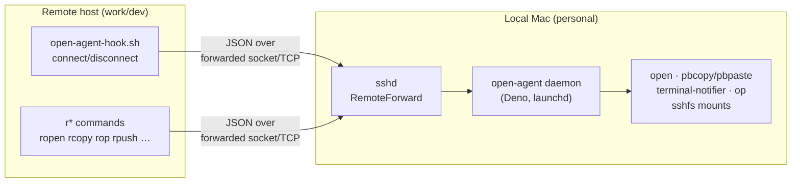
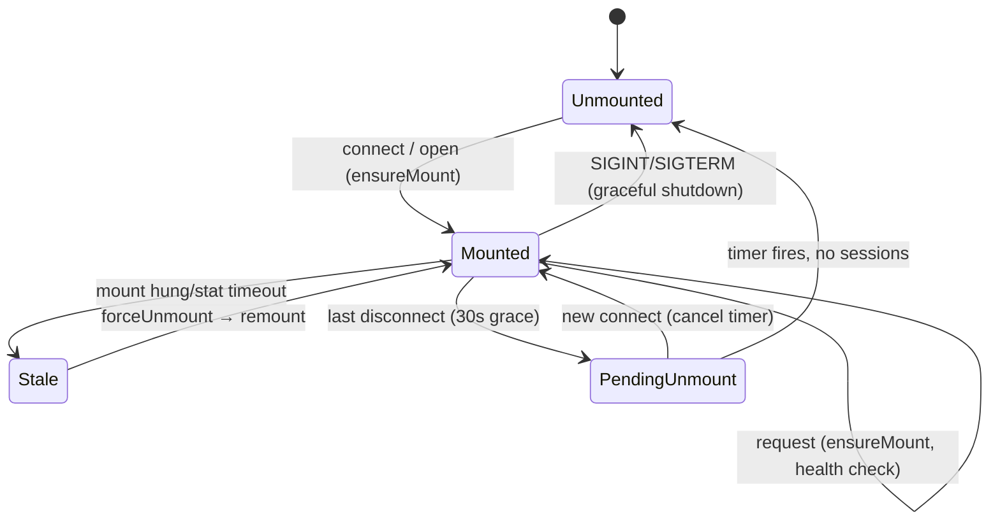
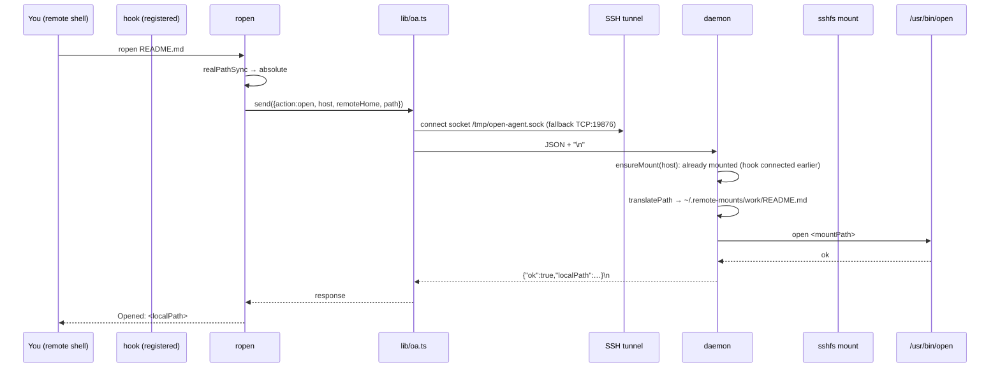

# Architecture

> **open-agent** bridges a local Mac's native capabilities to remote SSH
> sessions. A Deno daemon running on the personal Mac accepts JSON requests from
> remote machines (over an SSH-forwarded socket or TCP) and performs local
> actions: opening files, sharing the clipboard, transferring files, sending
> notifications, opening URLs, proxying 1Password, and managing SSHFS mounts.

This document describes the system as built. For day-to-day usage see
[`remote-workflow.md`](./remote-workflow.md); for transport evolution see
[`connectivity-plan.md`](./connectivity-plan.md).

---

## 1. High-level model

There are always **two sides**:

| Side | Runs | Role |
|------|------|------|
| **Local Mac** (personal) | `open-agent-daemon.ts` (Deno, launchd) | Server: receives requests, executes local actions |
| **Remote host** (work Mac, dev box, etc.) | `r*` client scripts + `open-agent-hook.sh` | Clients: send JSON requests over a forwarded transport |

The two sides are connected by SSH. SSH `RemoteForward` tunnels the daemon's
listener to a fixed path/port on the remote, so the remote scripts can reach the
daemon as if it were local.



---

## 2. Component map (repo layout)

```
open-agent-daemon.ts        # The daemon (local side, server)
open-agent-hook.sh          # Remote shell hook (sourced in .zshrc/.bashrc)
com.open-agent.daemon.plist # launchd service template (YOURUSER placeholders)
install.sh                  # Local installer (curl|sh or --local)
ssh_config.example          # SSH RemoteForward reference

bin/
├── open-agent              # Local CLI: setup-remote, update, status, version
├── rproj                   # Local project browser (fzf, multi-host, Alfred)
├── ropen                   # Remote: open files/URLs/VS Code
├── rcode                   # Remote↔local aware: delegates to ropen or rproj
├── rcopy  / rpaste         # Remote: clipboard
├── rpush  / rpull          # Remote: file transfer
├── rnotify                 # Remote: macOS notifications
├── rop                     # Remote: 1Password CLI proxy
├── rtmux                   # Remote↔local: wrapper → rproj tmux
└── lib/
    └── oa.ts               # Shared client transport library (send/checkResponse)

docs/
├── architecture.md         # This file
├── remote-workflow.md      # User guide / setup
├── connectivity-plan.md    # Transport layer design (socket, TCP, Tailscale)
└── ipad-support-plan.md    # iPad client roadmap
```

Scripts are written in **TypeScript run by Deno** (each declares its own granular
`--allow-*` permissions in its shebang), except the hook (`bash`) and the
installer (`bash`).

---

## 3. The daemon (`open-agent-daemon.ts`)

The daemon is a single-file Deno program. It has four logical regions:

### 3.1 Listeners (transport in)

`main()` opens **two** listeners in parallel:

1. **Unix socket** — `~/.local/share/open-agent/open-agent.sock` (primary)
2. **TCP** — `127.0.0.1:19876` (fallback for Tailscale SSH / iPad clients)

Both feed the same `acceptConnections()` → `handleConnection()` loop. The TCP
listener exists precisely because some SSH implementations (Tailscale SSH, iPad
apps) cannot forward Unix sockets — see `connectivity-plan.md`.

> The daemon does **not** authenticate connections. Binding is strictly
> localhost, which is safe only because traffic arrives inside an SSH tunnel.
> Exposing the TCP listener beyond loopback would require adding auth (not yet
> implemented).

### 3.2 Wire protocol: JSON-over-newline

A connection = **one request, one response**, both single-line JSON.

```
client → {"action":"open","host":"work","remoteHome":"/home/me","path":"…"}\n
server → {"ok":true,"localPath":"/Users/me/.remote-mounts/work/…"}\n
```

`parseMessage()` validates the discriminated `Message` union field-by-field and
rejects anything malformed. The full action set:

| Action | Purpose | Local side-effect |
|--------|---------|-------------------|
| `connect` / `disconnect` | Session lifecycle → mount/unmount | registers session id; on last disconnect, schedules unmount |
| `open` | Open a file in default/specific app | `sshfs` mount → translate path → `open` |
| `open-vscode` | Open in VS Code remote-SSH | `code --remote ssh-remote+<host> <path>` (no mount) |
| `open-url` | Open http(s) URL in browser | `open <url>` |
| `copy` / `paste` | Clipboard | `pbcopy` / `pbpaste` |
| `notify` | macOS notification | `terminal-notifier` |
| `push` | Remote file → local | copy via SSHFS mount → `~/Downloads` (or `-d`) |
| `pull` | Local file → remote | copy via SSHFS mount to remote dest |
| `op-read` | Resolve one `op://` ref | `op read` (local 1Password CLI) |
| `op-resolve` | Resolve many `op://` refs in parallel | `op read` × N via `Promise.all` |
| `status` | Daemon introspection | returns version, mounts, sessions |

Every handler returns a JSON object with `ok: boolean` and either a result or an
`error` string. Secret-bearing actions (`op-read`, `op-resolve`) deliberately do
**not** log the references or resolved values.

### 3.3 SSHFS mount management

The most intricate part of the daemon. One mount per remote host, at
`~/.remote-mounts/<host>`, mounted on demand and torn down when idle.



Key implementation details:

- **Per-host serialization (`mountLocks`)** — `ensureMount()` chains on a promise
  keyed by host so concurrent requests never spawn parallel `sshfs` processes.
  The chain uses `.catch()` shunts so one failed mount doesn't block later ones.
- **Health check** — `isMountResponsive()` runs `stat` with a 3s `AbortSignal`
  timeout. A hung FUSE mount would otherwise block indefinitely.
- **Stale recovery** — if the mount exists but is unresponsive, `forceUnmount()`
  (plain `umount`, then macOS `diskutil unmount force`) and remount.
- **Session accounting** — `connect` adds a `sessionId` to a `Set`; `disconnect`
  removes it. When the set empties, `scheduleUnmount()` arms a 30s timer
  (`UNMOUNT_GRACE_MS`); any new `connect` cancels it.
- **Path translation** — `translatePath()` `normalize()`s the remote path and
  requires it to be under the remote `$HOME`; it then rewrites it onto the mount
  point. Paths outside `$HOME` are rejected (only `$HOME` is mounted).
- **Graceful shutdown** — `SIGINT`/`SIGTERM` close both listeners, remove the
  socket, and unmount every host before exiting.

`sshfs` is invoked with reconnect + keepalive options and metadata caching
(`cache=yes`, `cache_timeout=120`) since slightly-stale attributes are fine for
opens.

### 3.4 Logging

`initLog()` opens `~/.local/share/open-agent/agent.log` for append; `log()`
writes a timestamped line to both stdout (captured by launchd) and the file.

---

## 4. The remote side

### 4.1 Transport library (`bin/lib/oa.ts`)

Shared by every `r*` client. Central pieces:

- **Identity resolution (`resolveHost`)** — how the remote names itself to the
  daemon, used as the mount key:
  1. `OPEN_AGENT_HOST` env var, else
  2. `~/.config/open-agent/identity` file, else
  3. `hostname -s`
- **`send(message, timeoutSec)`** — the core client call:
  1. If the Unix socket (`OPEN_AGENT_SOCK`, default `/tmp/open-agent.sock`)
     exists, try it with a 2s connect timeout.
  2. On any failure, fall back to TCP (`OPEN_AGENT_TCP_HOST`/`_PORT`, default
     `127.0.0.1:19876`).
  3. If both fail, throw a message listing what was tried.

  This dual-transport-with-fallback is what makes the same scripts work over
  plain OpenSSH (socket) *and* Tailscale SSH / iPad clients (TCP).
- **Helpers** — `requireSock()` (warn-only; TCP may still work), `fail()`,
  `checkResponse()`, `getStringField()`.

### 4.2 The shell hook (`open-agent-hook.sh`)

Sourced from the remote shell profile. It:

- Only activates when `$SSH_CONNECTION` is set (i.e., a real SSH session).
- Computes the same host identity as `lib/oa.ts` and a unique `sessionId`
  (`$$-<epoch>`).
- Sends `connect` on shell start and traps `EXIT HUP TERM` to send `disconnect`.
  This is what drives the daemon's mount/unmount lifecycle.
- Aliases `open` → `ropen` and defines an `oa-status` function.
- Uses `socat` (or `nc`) to talk to the socket — bash-only, no Deno dependency,
  so it runs before any `r*` tool is invoked.

### 4.3 The client commands

All are Deno scripts that build a message, call `send()`, and act on the
response. Notable behaviors:

- **`ropen`** — detects URLs (`open-url`) vs VS Code (`open-vscode`, by `-v` or
  app name heuristics) vs plain files (`open`). If the agent is unreachable it
  **falls back to the native `/usr/bin/open`** so it degrades gracefully when the
  tunnel dies.
- **`rop`** — 1Password proxy. `read` resolves a single `op://` ref; `run`
  parses one or more `--env-file`s plus the live environment, collects every
  `op://` value, resolves them in one `op-resolve` batch, then `exec`s the target
  command with the resolved env.
- **`rpush`/`rpull`** — file transfer through the SSHFS mount (push = remote→
  local Downloads; pull = local→remote).
- **`rcode` / `rtmux`** — *context-aware*: if `$SSH_CONNECTION` is set they
  delegate to the remote path (`ropen -v`), otherwise to the local `rproj`.

---

## 5. Local-only tooling

These never run on the remote host:

### `open-agent` (CLI)

Manages the toolkit itself from the local Mac:

- `setup-remote <host|all>` — reads `remote-hosts`, tars the `r*` scripts +
  `lib/oa.ts` + hook, and deploys them over SSH to `~/.local/bin` on each remote.
- `update` — fetches the latest GitHub release tarball and runs `install.sh --local`.
- `status` — sends `{"action":"status"}` to the daemon socket and pretty-prints
  mounts/sessions.
- `version`.

### `rproj` (project browser)

The largest component. Discovers projects across multiple remote hosts and opens
them via tmux, VS Code remote-SSH, or Finder (SSHFS).

- **Config** — `~/.config/open-agent/remote-hosts` (`alias|dir|label`, legacy
  `~/.config/rproj/*` auto-detected). A host can appear with multiple dirs.
- **Discovery** — `ssh` into each host with `-o ControlPath=none` (so
  `ConnectTimeout` is honored even with a hung `ControlMaster`) and `find` the
  configured dirs. Parallel across hosts, 3–5s timeouts, offline hosts silently
  omitted.
- **Selection** — an fzf picker grouped by label with tree connectors; fzf
  `--preview` shells back into `rproj _preview*` to show git status + contents
  over SSH.
- **Resolution** — `-p NAME` resolves a project by basename match (no SSH) or by
  probing candidate dirs; disambiguates multi-host matches with another fzf.
- **Actions** — `tmux` (ssh + `tc`), `code` (`code --remote`), `finder` (sends an
  `open` to the daemon via the socket), or an interactive action picker.
- **Alfred integration** — `list --json` emits Alfred workflow JSON; `open` takes
  `host|path`.

`rproj` talks to the daemon directly over the local Unix socket (not `lib/oa.ts`,
since it always runs locally where the socket lives).

---

## 6. Installation & lifecycle

### Local install (`install.sh`)

Two modes: `curl | bash` (downloads latest release tarball then re-execs
`--local`), or `./install.sh --local` from a clone. The local mode:

1. Checks prerequisites (deno, sshfs; warns on terminal-notifier).
2. Copies daemon → `~/.local/share/open-agent/`, `bin/*` → `~/.local/bin/`,
   `lib/oa.ts` → `~/.local/bin/lib/`, hook → `~/.local/share/open-agent/`.
3. `sed`-substitutes `YOURUSER`/deno path in the plist →
   `~/Library/LaunchAgents/com.open-agent.daemon.plist`, then `launchctl
   bootout`/`bootstrap` (with a retry to dodge the bootout/bootstrap race).
4. Verifies the socket is live and migrates legacy config.

### launchd service (`com.open-agent.daemon.plist`)

- `RunAtLoad` + `KeepAlive` on non-zero exit → the daemon stays up and restarts
  on crash.
- Uses a **mise shim** for `deno` so the path survives Deno version upgrades.
- Sets a `PATH` including `/opt/homebrew/bin` so `sshfs`, `op`, etc. are found.

### Releases (`.github/workflows/release.yml`)

On a `v*` tag, builds a versioned tarball of daemon + plist + install.sh + hook +
ssh_config + `bin/`, and publishes a GitHub release with auto-generated notes.
`open-agent update` consumes exactly this tarball.

---

## 7. Data flow walkthrough: `ropen README.md`



The hook's earlier `connect` ensured the SSHFS mount was already up; the file's
bytes are fetched by macOS `open` through that mount.

---

## 8. Configuration reference

| File | Side | Purpose |
|------|------|---------|
| `~/.config/open-agent/remote-hosts` | local | `alias\|dir\|label` rows for `rproj`/`setup-remote` |
| `~/.config/open-agent/identity` | remote | Host identity (when not via env/hostname) |
| `~/.local/share/open-agent/open-agent.sock` | local | Unix socket |
| `~/.remote-mounts/<host>/` | local | SSHFS mount points |
| `~/Library/LaunchAgents/com.open-agent.daemon.plist` | local | launchd service |
| `~/.local/bin/{r*,open-agent,rproj}` | both | Installed scripts |

| Env var | Default | Side | Meaning |
|---------|---------|------|---------|
| `OPEN_AGENT_HOST` | hostname | remote | Host identity |
| `OPEN_AGENT_SOCK` | `/tmp/open-agent.sock` | remote | Forwarded socket path |
| `OPEN_AGENT_TCP_HOST` / `OPEN_AGENT_TCP_PORT` | `127.0.0.1` / `19876` | remote | TCP fallback target |

| Daemon constant | Default | Meaning |
|-----------------|---------|---------|
| `UNMOUNT_GRACE_MS` | `30000` | Idle grace before unmount |
| sshfs `cache_timeout` | `120` | Metadata cache seconds |

---

## 9. Design principles & constraints

- **Degraded operation by design.** `ropen` falls back to native `open`; the
  transport falls back from socket → TCP. Nothing hard-fails if the agent is
  briefly unreachable.
- **Localhost-only, trust-the-tunnel security.** No auth; safe only because the
  daemon binds loopback and all traffic rides SSH. (Network exposure would need
  the token-auth work sketched in `connectivity-plan.md`.)
- **Stateful mount, stateless connections.** Each connection is one shot, but the
  daemon holds long-lived `MountState` keyed by host with session refcounts.
- **Per-host isolation.** Host alias is the key everywhere; multiple remotes get
  independent mounts and session sets.
- **macOS-only daemon.** The local side assumes `open`, `diskutil`, launchd,
  macFUSE. The remote side is portable (just Deno + socat/nc).
- **No build step.** Every script is run directly by Deno with declared
  permissions in its shebang; releases are plain tarballs.

---

## 10. Evolution / open work

From `connectivity-plan.md` and `ipad-support-plan.md`:

- **Tailscale direct transport** — client env vars already let a remote point at
  a Tailscale IP; the missing pieces are daemon-side binding beyond loopback and
  a shared-secret auth token (`{"token":"…"}` field) for non-localhost connections.
- **iPad support** — leans on the TCP transport (iPad SSH clients can't forward
  Unix sockets), hence the `127.0.0.1:19876` listener.
- **Auth model** — open question whether a shared token suffices or Tailscale
  device identity should be used for direct connections.
```
