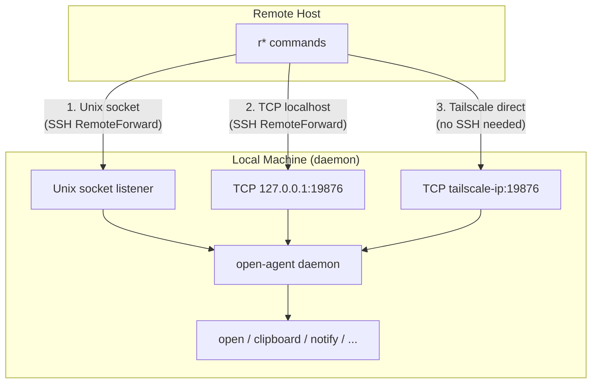

# Connectivity & Transport Plan

- Status: Draft / Brainstorming
- Date: 2026-03-18

## Overview

The open-agent daemon on macOS receives commands from remote hosts via a forwarded transport. The `r*` commands (ropen, rcopy, rpaste, etc.) run on remote SSH hosts and communicate back to the local daemon.

This document covers the transport layer — how remote commands reach the daemon — independently of which platform runs the daemon.

## Transport Options

### 1. Unix Domain Socket (original, implemented)

The daemon listens on a Unix socket at `~/.local/share/open-agent/open-agent.sock`. Remote hosts reach it via SSH `RemoteForward`:

```
RemoteForward /tmp/open-agent.sock /Users/you/.local/share/open-agent/open-agent.sock
```

**Pros:**
- No port conflicts
- File-permission-based access control
- Works reliably with standard OpenSSH

**Cons:**
- Requires `StreamLocalBindUnlink yes` on the remote sshd
- Not supported by Tailscale SSH
- Not supported by iPad SSH clients (Secure ShellFish, Blink)

### 2. TCP Localhost Fallback (implemented)

The daemon also listens on `127.0.0.1:19876`. Remote hosts reach it via SSH `RemoteForward`:

```
RemoteForward 19876 127.0.0.1:19876
```

The client library (`lib/oa.ts`) tries the Unix socket first, then falls back to TCP. Both the host and port are configurable via environment variables (`OPEN_AGENT_TCP_HOST`, `OPEN_AGENT_TCP_PORT`), defaulting to `127.0.0.1:19876`.

**Pros:**
- Universally supported by all SSH clients (including Tailscale SSH, iPad clients)
- Same JSON-over-newline protocol — no changes needed
- Localhost-only binding — equivalent security to Unix socket when tunneled
- Host/port overridable via env vars — enables ad-hoc Tailscale direct connections without daemon changes (see below)

**Cons:**
- Port conflicts possible (though `19876` is unlikely to collide)
- Slightly weaker access control than Unix socket file permissions

### 3. Tailscale Direct Connection (proposed)

When both the local machine (running the daemon) and the remote host are on the same Tailscale tailnet, the remote commands could connect directly to the daemon over the tailnet — no SSH tunnel required.

#### Partial Support Today

The client-side env vars `OPEN_AGENT_TCP_HOST` and `OPEN_AGENT_TCP_PORT` already exist in `lib/oa.ts`. If the daemon were configured to bind to its Tailscale IP (or `0.0.0.0`), a remote host could connect directly by setting `OPEN_AGENT_TCP_HOST=macbook.tailnet.ts.net` — no client code changes needed. The missing pieces are daemon-side binding and authentication.

#### How Full Support Would Work

1. The daemon optionally binds to its Tailscale IP in addition to `127.0.0.1`
2. Remote `r*` commands detect the tailnet and connect directly
3. Falls back to the existing Unix socket / TCP-over-SSH path if direct connection fails

#### Detection Strategy

**On the daemon side (macOS):**
- Run `tailscale ip -4` at startup to get the device's Tailscale IP
- If Tailscale is active, bind the TCP listener to the Tailscale IP as well (or to `0.0.0.0` with a firewall/auth check)
- Optionally register the daemon's address via `tailscale set --advertise-tags` or a known MagicDNS name

**On the remote side (`lib/oa.ts`):**
- Check if `tailscale status --json` shows the target machine as a peer
- Or simpler: attempt a connection to the daemon's known Tailscale hostname (e.g., `macbook.tailnet-name.ts.net:19876`)
- The hostname could be configured via `~/.config/open-agent/tailscale-host` or an environment variable (`OPEN_AGENT_TAILSCALE_HOST`)

**Connection priority in `lib/oa.ts` would become:**
1. Unix socket (fastest, works for standard SSH forwarding)
2. TCP localhost (works for Tailscale SSH and iPad SSH clients)
3. TCP over Tailscale direct (works without any SSH tunnel)

#### Security Considerations

Binding beyond `127.0.0.1` changes the security model:

- **Tailscale IP only**: Safe if you trust all devices on your tailnet. Tailscale provides WireGuard encryption and identity-based access.
- **Authentication**: The current protocol has no authentication — any connection to the port can execute commands. This is fine for localhost but would need at least a shared secret or token for network-exposed listeners.
- **ACL option**: Tailscale ACLs could restrict which tailnet devices can reach the port, but this is a network-level control, not application-level.

A simple approach: generate a random token on daemon startup, write it to `~/.config/open-agent/auth-token`, and require it in the JSON message for non-localhost connections. The remote side reads the token from a config file or environment variable set during SSH session setup.

#### Protocol Changes

Minimal. The JSON-over-newline protocol works unchanged. The only addition would be an optional `token` field in messages for authenticated connections:

```json
{"action": "paste", "token": "abc123..."}
```

The daemon would enforce token validation only for connections arriving on non-localhost interfaces.

## Architecture Diagram



## Current Implementation Status

| Transport | Status | Notes |
|-----------|--------|-------|
| Unix socket | Implemented | Primary path for standard SSH |
| TCP localhost | Implemented | Fallback for Tailscale SSH and iPad clients |
| Tailscale direct | Partially possible | Client env vars exist; requires daemon bind changes and auth |

## Open Questions

- **Auth mechanism**: Is a simple shared token sufficient, or should Tailscale device identity (via the local API) be used for authentication?
- **Auto-discovery**: Should the daemon announce itself on the tailnet (e.g., via a known MagicDNS name), or require explicit configuration of the Tailscale hostname?
- **Binding strategy**: Bind to the Tailscale interface specifically (`tailscale ip -4`), or bind `0.0.0.0` and filter by source? The former is simpler; the latter survives Tailscale IP changes.
- **Multiple daemons**: If you run open-agent on multiple Macs on the same tailnet, how does a remote host know which one to connect to? Likely needs explicit config per-host.
