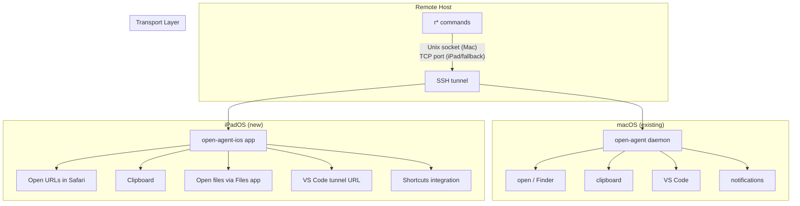

# iPad Support Plan

- Status: Draft / Brainstorming
- Date: 2026-03-18

## Motivation

The current open-agent architecture relies on SSH `RemoteForward` with Unix domain sockets to tunnel commands from remote hosts back to a macOS daemon. This works well from a Mac, but breaks down when working from an iPad:

- **Tailscale SSH** doesn't support Unix domain socket forwarding (see janus host issues)
- iPad SSH clients (Secure ShellFish, Blink) support TCP port forwarding but not Unix socket forwarding
- There's no open-agent daemon running on iPadOS to receive commands

Despite these constraints, a useful subset of the workflow can be made to work from iPad.

## Architecture Overview



## Phase 1: TCP Listener in open-agent

**Goal**: Add a TCP transport alongside the existing Unix socket. This unblocks iPad support *and* fixes the Tailscale SSH forwarding issue.

### Changes

- **open-agent-daemon.ts**: Listen on both the Unix socket and a localhost TCP port (e.g., `127.0.0.1:19876`)
- **lib/oa.ts** (remote side): Try Unix socket first, fall back to `localhost:19876` via TCP
- **SSH config**: iPad clients use `RemoteForward 19876 127.0.0.1:19876` instead of socket forwarding
- **Tailscale hosts**: Can also use TCP forwarding, bypassing the socket limitation entirely

### Protocol

No changes needed. The existing JSON-over-newline protocol works identically over TCP.

### Security

The TCP port binds to `127.0.0.1` only — not exposed to the network. Combined with SSH tunnel, the security model is equivalent to the Unix socket approach.

## Phase 2: iPadOS App (Swift)

**Goal**: A native iPadOS app (`open-agent-ios`) that receives commands from remote hosts and executes local actions.

### Repository

Separate repo: `open-agent-ios` (Swift/SwiftUI)

### Core Capabilities

| Action | Implementation |
|--------|---------------|
| Open URL | `UIApplication.shared.open(url)` — opens in Safari |
| Clipboard write | `UIPasteboard.general.string = content` |
| Clipboard read | `UIPasteboard.general.string` |
| Open file | Open via Secure ShellFish's File provider (see below) |
| VS Code | Open `vscode.dev` tunnel URL in Safari or Blink |
| Notifications | `UNUserNotificationCenter` local notifications |

### Transport Options

The app needs to receive commands from remote hosts via SSH tunnel. Options:

1. **TCP listener** — The app listens on a localhost port. iPad SSH clients forward the remote port to this local port. Challenge: iPadOS aggressively suspends background apps, so the listener may not stay alive.

2. **Tailscale direct** — If both iPad and Mac are on the same tailnet, the iPad app could connect directly to the Mac's open-agent. No SSH tunnel needed for this path, but requires Tailscale.

3. **Network Extension** — An iOS Network Extension can run in the background and maintain the TCP listener. More complex to implement but solves the suspension problem.

4. **Hybrid** — Use the TCP listener when the app is foregrounded. For background delivery, use a lightweight relay (e.g., push notification via a small cloud function) as a fallback.

### File Opening via Secure ShellFish

Secure ShellFish exposes remote filesystems through the iPadOS Files app. The file provider path follows a pattern like:

```
ShellFish/<server-name>/<remote-path>
```

The iPad app would:

1. Receive an `open` action with `host` and `path`
2. Map to the Secure ShellFish file provider URL
3. Use `UIDocumentInteractionController` to open the file with a compatible app

This requires:
- The remote host is configured in Secure ShellFish
- A mapping from open-agent host aliases to Secure ShellFish server names
- Discovery of which iPadOS apps can handle the file type

### VS Code via Tunnels

For code editing from iPad:

1. Run `code tunnel` on the remote host (creates a persistent tunnel to `vscode.dev`)
2. When the iPad app receives an `open-vscode` action, construct the `vscode.dev` tunnel URL
3. Open in Safari or in Blink's built-in VS Code

The remote `ropen -v` command could detect the iPad environment and output/open the tunnel URL instead of trying to launch a local VS Code instance.

### Shortcuts Integration

The iPad app can expose actions via the Shortcuts app using `AppIntents`:

- "Open URL on remote" — trigger ropen from Shortcuts
- "Copy from remote clipboard" — pull clipboard from a remote session
- "Check agent status" — show active sessions

## Phase 3: Graceful Degradation in Remote Scripts

**Goal**: Remote `r*` commands detect the client environment and adapt behavior.

### Detection Strategy

The remote scripts can detect the environment via:

1. **Agent capability negotiation** — On connect, the agent reports what actions it supports. The iPad agent would report a different capability set than the macOS agent.
2. **Environment variable** — `OPEN_AGENT_CLIENT=ipad` set via SSH `SetEnv`
3. **Terminal detection** — Check `$TERM_PROGRAM` or `$LC_TERMINAL` for Secure ShellFish / Blink signatures

### Fallback Behavior

| Command | macOS agent | iPad agent | No agent |
|---------|------------|------------|----------|
| `ropen file.md` | Open in default app via SSHFS | Open via Files app provider | `xdg-open` / native `open` |
| `ropen url` | Open in browser | Open in Safari | Print URL |
| `ropen -v path` | VS Code remote-ssh | vscode.dev tunnel URL | Print path |
| `rcopy` | pbcopy | UIPasteboard | OSC 52 escape sequence |
| `rpaste` | pbpaste | UIPasteboard | OSC 52 (if supported) |
| `rnotify` | terminal-notifier | Local notification | Print to stderr |

## Open Questions

- **Background execution**: What's the most reliable way to keep a TCP listener alive on iPadOS? Network Extension is the robust answer but adds App Store review complexity.
- **Tailscale as primary transport**: If both devices are always on the tailnet, should the iPad app skip SSH tunneling entirely and connect directly to the Mac's agent? This would also enable Mac-to-Mac without SSH.
- **File provider mapping**: How reliable is the Secure ShellFish file provider path? Does it change across app updates? Is there a URL scheme we can use instead?
- **Blink vs Secure ShellFish**: Should we target one client primarily, or keep the approach client-agnostic?
- **App Store viability**: A TCP listener app is fine for personal use via TestFlight/ad-hoc, but may face scrutiny for App Store distribution. Is that a concern?
